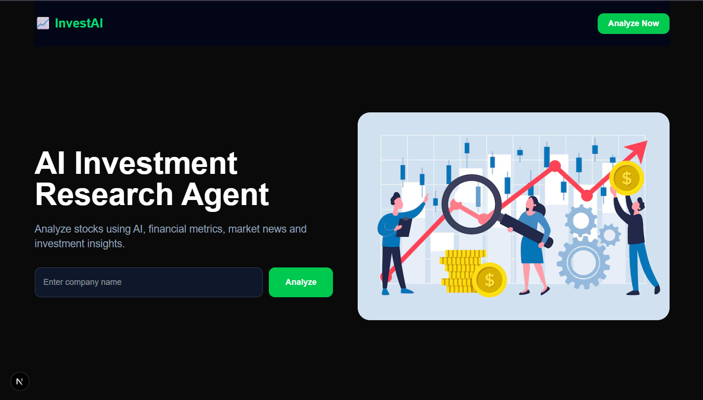
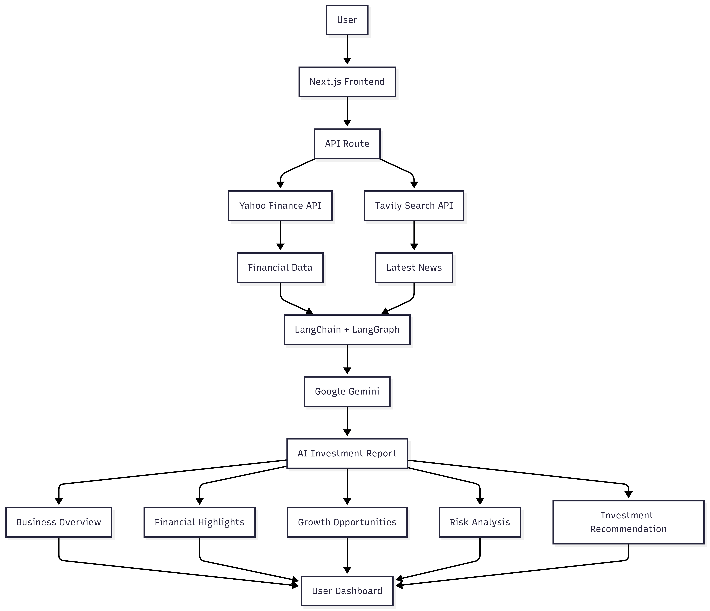

# AI Investment Research Agent

> A full-stack AI application that leverages Google Gemini, LangChain, LangGraph, Yahoo Finance, and Tavily Search to automate equity research and generate intelligent, data-driven investment reports.

## Project Preview

<p align="center">
  
</p>

## Overview

AI Investment Research Agent is a full-stack AI-powered web application that simplifies stock research by combining real-time financial data, the latest market news, and advanced Large Language Models (LLMs). Users can enter a company's name and receive a comprehensive investment report within seconds.

The application integrates Google Gemini, LangChain, LangGraph, Yahoo Finance, and Tavily Search to analyze company fundamentals, recent developments, potential risks, and growth opportunities. It generates structured, data-driven investment insights with an AI-powered recommendation, making equity research faster, smarter, and more accessible.

## Problem Statement

Conducting investment research is often a time-consuming process that requires analyzing financial statements, tracking market trends, and reading news from multiple sources. This fragmented workflow makes it difficult for investors to quickly evaluate a company's overall performance and make informed decisions.

Existing platforms typically provide raw financial data or news independently, leaving users to manually interpret and combine the information. There is a need for an intelligent solution that consolidates these data sources and delivers clear, structured, and actionable investment insights in a single place.

## Solution

AI Investment Research Agent addresses this challenge by integrating real-time financial data from Yahoo Finance, the latest market news from Tavily Search, and AI-powered reasoning using Google Gemini. The application automates the investment research process by collecting, analyzing, and summarizing relevant information into a comprehensive investment report.

The generated report includes a business overview, key financial metrics, growth opportunities, potential risks, market sentiment, and an AI-powered investment recommendation with a confidence score, enabling users to make faster and more informed investment decisions.

## Features

Real-Time Financial Data – Fetches up-to-date stock prices, valuation metrics, and company fundamentals using Yahoo Finance.

Latest Market News – Aggregates recent company news and market developments through Tavily Search.

AI-Powered Investment Analysis – Utilizes Google Gemini to analyze financial data and news, generating intelligent investment insights.

Comprehensive Investment Report – Provides a structured report including company overview, financial highlights, growth opportunities, risks, and market sentiment.

AI Investment Recommendation – Delivers an AI-generated investment verdict with a confidence score to support decision-making.

Fast & Responsive Interface – Built with Next.js and React to ensure a smooth, responsive, and user-friendly experience.

Automated Research Workflow – Eliminates the need to manually gather information from multiple financial platforms by automating the entire research process.

## System Architecture

<p align="center">
  
</p>

## Tech Stack

| Category                 | Technologies                        |
| ------------------------ | ----------------------------------- |
| **Frontend**             | Next.js, React, Tailwind CSS        |
| **Backend**              | Next.js API Routes, Node.js         |
| **AI & LLM**             | Google Gemini, LangChain, LangGraph |
| **Data Sources**         | Yahoo Finance, Tavily Search        |
| **Programming Language** | JavaScript                          |
| **Version Control**      | Git, GitHub                         |
| **Development Tools**    | Visual Studio Code                  |


## Project Structure

```text
AIINVESTMENTPROJECT/
├── app/
│   ├── api/
│   ├── favicon.ico
│   ├── globals.css
│   ├── layout.tsx
│   └── page.tsx
│
├── lib/
│   ├── finance.js
│   ├── graph.js
│   ├── tavily.js
│   └── ticker.js
│
├── public/
│   ├── aiinvestmentlogo.svg
│   ├── architecture.png
│   ├── hero.png
│   ├── Project-preview.png
│   └── *.svg
│
├── .env.local
├── .gitignore
├── AGENTS.md
├── CLAUDE.md
├── eslint.config.mjs
├── next.config.ts
├── package.json
├── package-lock.json
└── README.md
```
## Getting Started

Follow the steps below to set up and run the project locally.

### Prerequisites

Make sure the following tools are installed on your system:

* Node.js (v18 or later)
* npm
* Git

### Clone the Repository

```bash
git clone https://github.com/<your-username>/<your-repository>.git
```

### Navigate to the Project Directory

```bash
cd <your-repository>
```

### Install Dependencies

```bash
npm install
```

### Configure Environment Variables

Create a `.env.local` file in the project root and add the following environment variables:

```env
GOOGLE_API_KEY=your_google_gemini_api_key
TAVILY_API_KEY=your_tavily_api_key
```

### Start the Development Server

```bash
npm run dev
```

Open your browser and visit:

```text
http://localhost:3000
```

## Environment Variables

Create a `.env.local` file in the project root and configure the following environment variables:

```env
GOOGLE_API_KEY=your_google_gemini_api_key
TAVILY_API_KEY=your_tavily_api_key
```

| Variable         | Description                                                                      |
| ---------------- | -------------------------------------------------------------------------------- |
| `GOOGLE_API_KEY` | API key used to access Google's Gemini model for AI-powered investment analysis. |
| `TAVILY_API_KEY` | API key used to retrieve the latest company news and market information.         |

> **Note:** Never commit your `.env.local` file or API keys to GitHub. Keep your credentials secure and private.

## Usage

Using the AI Investment Research Agent is simple and requires only a few steps:

1. Launch the application in your browser.
2. Enter the name of a publicly traded company (e.g., **Apple**, **Tesla**, or **NVIDIA**).
3. Click the **Analyze** button to start the research process.
4. The application retrieves:

   * Real-time financial data from Yahoo Finance.
   * Latest company news using Tavily Search.
5. Google Gemini analyzes the collected information and generates a comprehensive investment report.
6. Review the AI-generated report, which includes:

   * Business Overview
   * Financial Highlights
   * Growth Opportunities
   * Risk Analysis
   * Investment Recommendation
   * Confidence Score

## Workflow

The following workflow illustrates how the AI Investment Research Agent processes a user's request:

1. **User Input** – The user enters the name of a publicly traded company.
2. **Ticker Identification** – The application identifies the corresponding stock ticker symbol.
3. **Financial Data Retrieval** – Company financial data is fetched from Yahoo Finance.
4. **News Aggregation** – The latest company-related news is retrieved using Tavily Search.
5. **AI Processing** – LangChain and LangGraph organize the collected data and pass it to Google Gemini for analysis.
6. **Report Generation** – Google Gemini generates a structured investment report.
7. **Results Display** – The generated report is presented to the user through the web interface.

## 📡 API Endpoints

### 1. Analyze Company

**Endpoint**

```http
POST /api/analyze
```

**Description**

Analyzes a publicly traded company by combining financial data, recent news, and AI-generated insights.

**Request Body**

```json
{
  "company": "Tesla"
}
```

**Response**

```json
{
  "company": "Tesla",
  "ticker": "TSLA",
  "verdict": "SPECULATIVE_INVEST",
  "confidence": 70,
  "pros": [
    "Strong AI initiatives",
    "EV market leadership"
  ],
  "cons": [
    "High valuation",
    "Increasing competition"
  ]
}
```

---

### 2. Test API

**Endpoint**

```http
GET /api/test
```

**Description**

Checks whether the backend API is running correctly.

## Future Enhancements

The following features are planned for future releases to enhance the platform's capabilities:

*  Interactive stock price charts and technical indicators
*  Personalized watchlist for favorite companies
*  Real-time stock price and news alerts
*  Export investment reports as PDF
*  Multi-company comparison and benchmarking
*  Support for global stock markets
*  User authentication and personalized dashboards
*  AI-powered investment chatbot for financial queries
*  Enhanced mobile responsiveness and user experience

## Contributing

Contributions, suggestions, and feature requests are welcome. If you'd like to improve this project, feel free to fork the repository, create a new branch, and submit a pull request.

If you encounter any issues or have ideas for improvement, please open an issue in the repository.
